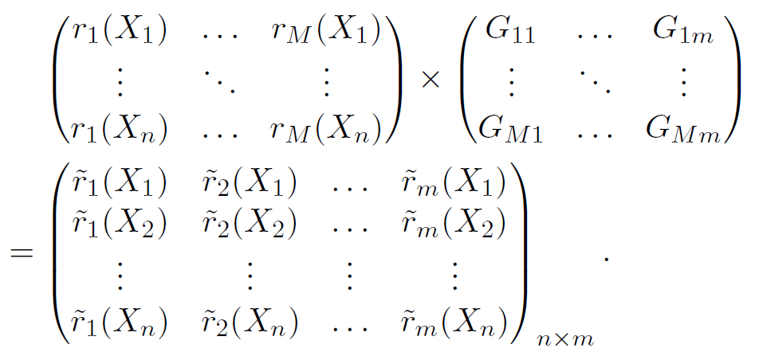
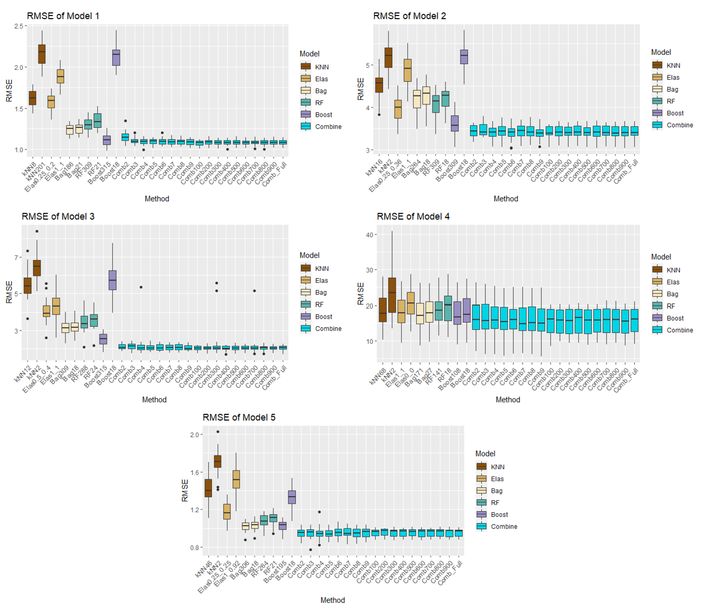
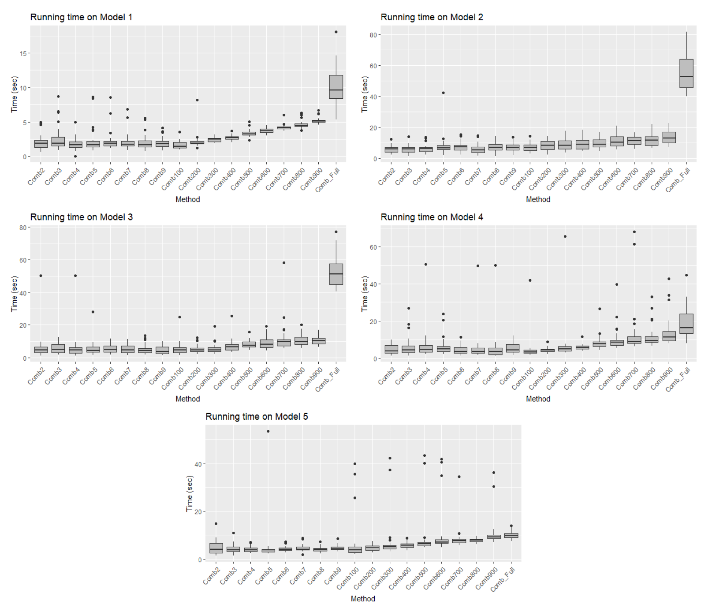
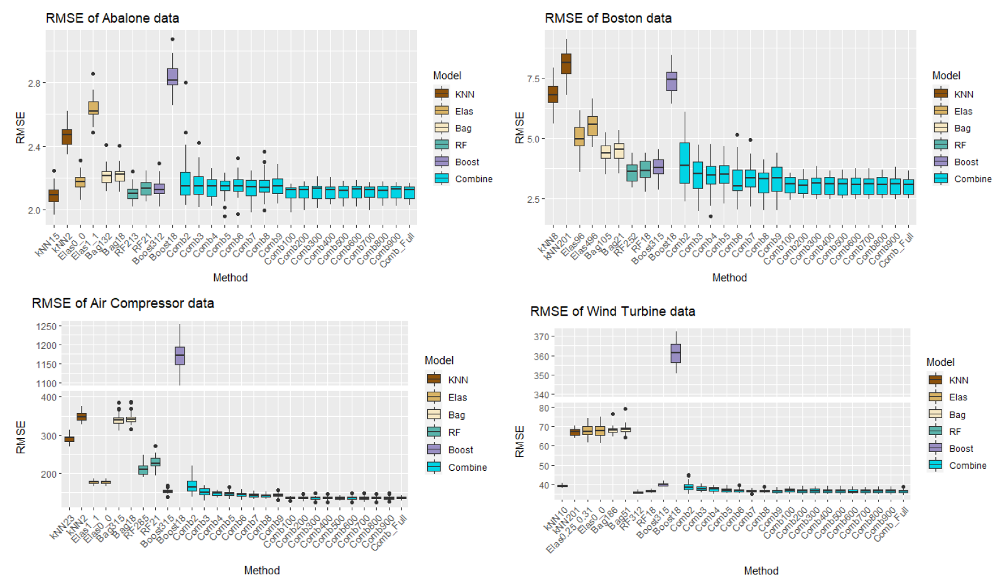
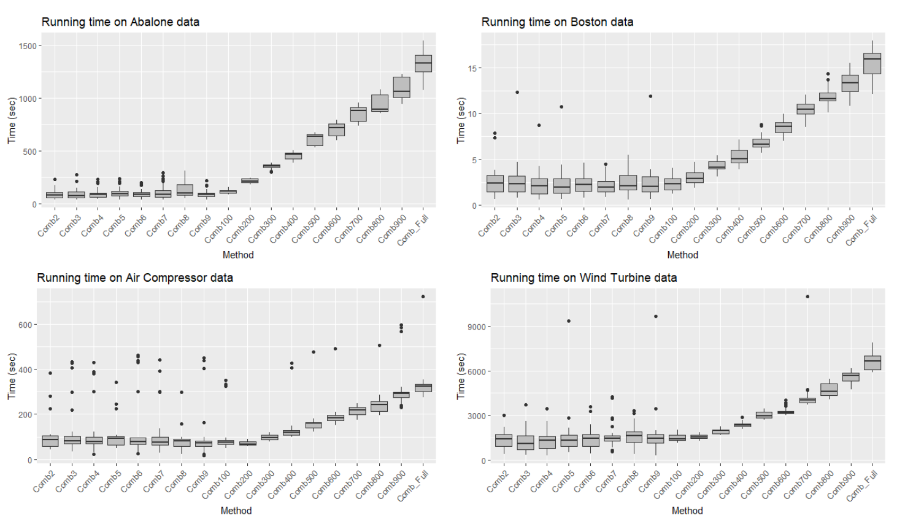

name: inter-slide
class: left, middle, inverse

{{ content }}

---

name: layout-general
layout: true
class: left, middle

```{r setup, child="loaders_fixers.Rmd", echo=FALSE, message=FALSE, warning=FALSE}

```


```{r, echo=FALSE}
#xaringanExtra::use_scribble()
xaringanExtra::use_webcam()
```

---

```{r child='title_slide.Rmd'}

```

---
template: inter-slide

## `r fontawesome::fa("map", fill="white")`

## I. Some studies & motivation

## II. Aggregation on randomly projected features

## III. Numerical simulation

---
template: inter-slide
class: center, middle, inverse

# I. Some studies & motivation


---

### .darkgreen[Setting]

- $(X,Y)\in\mathbb{R}^d\times{\cal Y}$ : input-output generic couple, where

    - ${\cal Y} = \{1,...,N\}$ : classification.
    
    - ${\cal Y} = \mathbb{R}$ : regression.

- ${\cal D}_n=\{(X_i,Y_i)_{i=1}^n\}$ : training data (iid copies of $(X,Y)$).

- ${\cal D}_{n}$ is partitioned into ${\cal D}_k=\{(X_i^{(k)},Y_i^{(k)})_{i=1}^k\}$ and ${\cal D}_{\ell}=\{(X_i^{(\ell)},Y_i^{(\ell)})_{i=1}^{\ell}\}$.

- ${\bf r}_k=(r_{k,1},...,r_{k,M})$: $M$ regression estimators constructed using ${\cal D}_k$.

- ${\bf c}_k=(c_{k,1},...,c_{k,M})$: $M$ classifiers constructed using ${\cal D}_k$.

---

## .darkgreen[Some studies]

.fl.w-50.pa2.f6[
### .darkgreen[Classification]
$$g_n({\bf c}(x))=\text{arg}\max_{1\leq k\leq N}\sum_{i=1}^{\ell}W_{n,i}(x)\mathbb{1}_{\{Y_i^{(\ell)}=k\}}.$$

- [Mojirsheibani (1999)](https://www.tandfonline.com/doi/abs/10.1080/01621459.1999.10474154):

$$W_{n,i}(x)=\mathbb{1}_{\{{\bf c}(x)={\bf c}(X_i^{(\ell)})\}}$$

- [Mojirsheibani (2016)](https://www.sciencedirect.com/science/article/abs/pii/S0167715216301304):
$$W_{n,i}(x)=K_h(d_{\cal H}({\bf c}(x),{\bf c}(X_i^{(\ell)})))$$
where
  - $d_{\cal H}$ : Hamming distance
  - $K_h(x)=K(x/h)$ for some $h>0$
  - with convention $0/0 = 0$
]

--
.fl.w-50.pa2.f6[
### .darkgreen[Regression]

$$g_n({\bf r}(x))=\sum_{i=1}^{\ell}W_{n,i}(x)Y_i^{(\ell)}.$$

- [Biau et al. (2016)](https://www.sciencedirect.com/science/article/pii/S0047259X15000950):

$$W_{n,i}(x)=\frac{\prod_{m=1}^M\mathbb{1}_{\{|r_{k,m}(x)-r_{k,m}(X_i^{(\ell)})|<h\}}}{\sum_{j=1}^{\ell}\prod_{m=1}^M\mathbb{1}_{\{|r_{k,m}(x)-r_{k,m}(X_j^{(\ell)})|<h\}}}$$

- [Has (2021)](https://hal.archives-ouvertes.fr/hal-02884333v5):

$$W_{n,i}(x)=\frac{K_h({\bf r}(x)-{\bf r}(X_i^{(\ell)}))}{\sum_{j=1}^{\ell}K_h({\bf r}(x)-{\bf r}(X_j^{(\ell)}))}$$
]


???

- Une idée clé de la prédiction est d'identifier le voisin du point de données dans l'espace d'entrée. C'est la même pour aggregation consenseille, sauf que les voisons sont en sense de predictions.

- La classe prédite est la classe avec le poids le plus lourd.

- Pour predire un classe de point $x$, on cherche pour tout les points $x_i$ de donnée apprentisage avec la même préditions que $x$. 

---

## .darkgreen[Consistency Inheritence Property (CIP)]

.fl.w-50.pa2.f6[
### .darkgreen[Classification]

- Loss: $\ell(x,y)=\mathbb{1}_{\{x\neq y\}}$

- Risk: ${\cal R}_{\bf c}(f)=\mathbb{P}(f(X)\neq Y)$

- Result: for any basic classifier $c_{k,m}$,

$$\lim_{k,\ell\to+\infty}\sup\{{\cal R}_{\bf c}(g_n({\bf c}(.))-{\cal R}_{\bf c}(c_{k,m}(.))\}\leq0.$$
- In particular, 

$$\exists c_{k,m_0}\text{ consistent }\Rightarrow\text{ so is }g_n({\bf c}(.)).$$
<br>
<br>
<br>
<br>
<br>
]

--

.fl.w-50.pa2.f6[
### .darkgreen[Regression]

- Loss: $\ell(x,y)=(x- y)^2$

- Risk: ${\cal R}_{\bf r}(f)=\mathbb{E}[(f(X)- Y)^2]$

- Let $\eta(x)=\mathbb{E}(Y|X=x)$ be the regression function, and

$${\cal R}_{\bf r}(f,\eta)=\mathbb{E}[(f(X)-\eta(X))^2].$$
- Result: 

$${\cal R}_{\bf r}(g_n({\bf r}(.)),\eta) \leq 
\min_{1\leq m\leq M}{\cal R}_{\bf r}(r_{k,m},\eta)+{\cal V}_{\ell}.$$

- In particular, 

$$\exists r_{k,m_0}\text{ consistent }\Rightarrow\text{ so is } g_n({\bf r}(.)).$$
]


---

### .darkgreen[`r fontawesome::fa("link")` From CIP]

- It is interesting to consider high-dimensional case of the aggregation.

- Here, .blue[high-dimension] refers to .blue[the number of basic estimators] $M$.

- A dimensional reduction is needed.

---
template: inter-slide
class: center, middle, inverse

# II. Aggregation on randomly projected features

---

# .darkgreen[Jonhson-Lindenstrauss Lemma (J-L)]

## .darkgreen[Method (regression)]

- For any $m<M$, let $G=(G_{i,j})$ be an $M\times m$, with $G_{i,j}\sim{\cal N}(0,1/m)$ independent.

- Random projection:

&nbsp;&nbsp;&nbsp;&nbsp; 

---
# .darkgreen[Jonhson-Lindenstrauss Lemma (J-L)]

## .darkgreen[Lemma (Johnson-Lindenstrauss)]

-----

Let $S_n = \{z_j\in\mathbb{R}^M:j=1,2,...,n\}$ denote a subset containing $n$ points of $\mathbb{R}^M$, $z_0\in\mathbb{R}^M$ fixed. Let $\tilde{z_0}$ and $\tilde{z_j}$ be the projected point of $z_0$ and $z_j$ respectively into $\mathbb{R}^m$ using the described random projection. Thus, for any $\delta\in(0,1)$, one has: 

$$\mathbb{P}\Big(\Big|\frac{\|\tilde{z_0}-\tilde{z_j}\|^2}{\|z_0-z_j\|^2}-1\Big|\leq \delta,\text{ for all } z_j\in S_n\Big)\geq 1-2n\exp(-m(\delta^2/2-\delta^3/3)/2).$$

------
<br>
<br>
<br>

---

# .darkgreen[`r fontawesome::fa("link")` Aggregation scheme]

- Two steps:
  - Step 1: predicted features ${\bf r}(.)\to \tilde{\bf r}(.)={\bf r}(.)G$ using J-L.
  
  - Step 2: aggregation method [Has (2021)](https://hal.archives-ouvertes.fr/hal-02884333v5) is implemented.  <br>
  More precisely, for any $x\in\mathbb{R}^d$, 
$$g_n(\tilde{\bf r}(x))=\sum_{i=1}^{\ell}\frac{K_h(\tilde{\bf r}(x)-\tilde{\bf r}(X_i^{(\ell)}))}{\sum_{j=1}^{\ell}K_h(\tilde{\bf r}(x)-\tilde{\bf r}(X_j^{(\ell)}))}Y_i^{(\ell)},$$
where $K_h(x)=\exp(-\|x/h\|^{\alpha}/\sigma)$ for some $\alpha,\sigma$ and $h>0$.

<br>
<br>

???

- The result doesn't depend on $M$.

- 

---

# .darkgreen[Theoretical result]

- Let $g_n({\bf r}(.))$ and $g_n(\tilde{\bf r}(.))$ be the aggregation using .blue[full] predicted features and .blue[projected] features respectively.

## .darkgreen[Theorem]
------
Assume that all the regressors $r_1,r_2,...,r_M$ and the response variable $Y$ are bounded almost surely by $R_0$, thus for any $h,\varepsilon>0, n\geq1,$ and for any $\delta\in(0,1)$, with the choice of $m$ satisfying: $m\geq C_1\frac{\log[2/(1-\sqrt[n]{1-\delta})]}{h^{2\alpha}\varepsilon^2}$, with $C_1=3(2+\alpha)^2(2R_0)^{2(1+\alpha)}/\sigma^2$, one has:
$$
\mathbb{P}\Big(|g_n({\bf r}(X))-g_n(\tilde{\bf r}(X))|>\varepsilon\Big)\leq \delta.
$$

------

- For large $n$, the lower bound of $m$ is of order $O\Big(\frac{\log(2n/\delta)}{h^{2\alpha}\varepsilon^2}\Big)$.

???

- $m$ assez grand.

---
exclude: true 

# .darkgreen[Theoretical result]

- Let $g_n({\bf r}(.))$ and $g_n(\tilde{\bf r}(.))$ be the aggregation using .blue[full] and .blue[projected] features respectively.

## .darkgreen[Theorem]

Assume that all the regressors $r_1,r_2,...,r_M$ and the response variable $Y$ are bounded almost surely by $R_0$, thus for any $h,\varepsilon>0, n\geq1,$ and for any $\delta\in(0,1)$,
$$
\mathbb{P}\Big(|g_n(\textbf{r}(X))-g_n(\tilde{\textbf{r}}(X))|>\varepsilon\Big)\leq 1-\Big[1-2\exp\Big(-\frac{mh^{2\alpha}\varepsilon^2}{3R_1^{2}}\Big)\Big]^n
$$

---
template: inter-slide
class: center, middle, inverse

# III. Numerical simulation

---

## .darkgreen[Basis regressors]

- $k$NN, elastic net, bagging, random forest, boosting (with different key parameters).

- Therefore, $M=1000$ (very highly correlated).

- Projected dimension $m\in\{2,3,...,9,100,200,...,900\}$.

- Root mean square errors (of $20\%$-testing data) over $30$ independent runs are reported

---

## .darkgreen[Simulated data (RMSE)]

&nbsp;&nbsp;&nbsp;&nbsp;&nbsp;&nbsp;&nbsp;&nbsp;&nbsp;&nbsp;&nbsp;&nbsp; 

???

- Le pire cas et le meilleur cas.
---

## .darkgreen[Simulated data (computational times)]

&nbsp;&nbsp;&nbsp;&nbsp;&nbsp;&nbsp;&nbsp;&nbsp; 

---

## .darkgreen[Real data (RMSE)]

&nbsp;&nbsp;&nbsp;&nbsp; 

---

## .darkgreen[Real data (computational times)]

&nbsp;&nbsp;&nbsp;&nbsp; 

---

# .darkgreen[Conclusion]

- Numerically, the full aggregation method works well even on high-dimensional (very correlated) features of predictions.

- The performances are almost preserved in much smaller subspaces.

- Several types of (highly redundant) models can be aggregated without model selection or cross validation.

- Theoretically and numerically, $m\approx O(\log(n))$ works.
---

```{r child='closing_slide.Rmd'}

```

---
template: inter-slide
class: left, middle, inverse

# References

&#128218; [Majid Mojirsheibani. Combined classifiers via discretization. Journal of the
American Statistical Association, 94(446):600–609, June 1999.](https://www.tandfonline.com/doi/abs/10.1080/01621459.1999.10474154)

&#128218; [Majid Mojirsheibani. A kernel-based combined classification rule. Journal of
Statistics and Probability Letters, 48(4):411–419, July 2000.]()

&#128218; [Majid Mojirsheibani and Jiajie Kong. An asymptotically optimal kernel combined
classifier. Journal of Statistics and Probability Letters, 119:91–100, 2016.](https://www.sciencedirect.com/science/article/abs/pii/S0167715216301304)

&#128218; [G. Biau, A. Fischer, B. Guedj, and J.D. Malley. COBRA: a combined regression
strategy. Journal of Multivariate Analysis, 146:18–28, 2016.](https://www.sciencedirect.com/science/article/pii/S0047259X15000950)

&#128218; [Sothea Has. A Kernel-based Consensual Aggregation for Regression. Preprint, April 2021.](https://hal.archives-ouvertes.fr/hal-02884333v5)

&#128218; [William B. Johnson and Joram Lindenstrauss. Extensions of lipschitz maps into a
hilbert space. Contemporary Mathematics, 26:189–206, 1984. doi: 10.1090/conm/
026/737400](https://doi.org/10.1007/BF02764938).

`r fontawesome::fa("github")` [https://github.com/hassothea/AggregationMethods](https://github.com/hassothea/AggregationMethods)
