name: layout-general
layout: true
class: left, top

```{r setup, child="loaders_fixers.Rmd", echo=FALSE, message=FALSE, warning=FALSE}

```


```{r, echo=FALSE}
#xaringanExtra::use_scribble()
xaringanExtra::use_webcam()
```

---
count: false

```{r child='title_slide.Rmd'}

```
</br></br>
---
template: inter-slide
class: left, middle, inverse
count: false

## `r fontawesome::fa("map", fill="rgba(83, 202, 95, 0.696);")` .section[Outline]

#### I. KFC procedure : clusterwise prediction via aggregation of distances

#### II. A kernel-based consensual aggregation for regression

#### III. Aggregation on randomly projected high-dimensional features for regression

---
template: inter-slide
class: left, middle, inverse
count: false
## `r fontawesome::fa("map", fill="rgba(83, 202, 95, 0.696);")` .section[Outline]

#### .section[I. KFC procedure : clusterwise prediction via aggregation of distances]

#### II. A kernel-based consensual aggregation for regression

#### III. Aggregation on randomly projected high-dimensional features for regression

---
class: left, top

## Motivation<h1br>
.fl.w-40.pa2.f6[
- Data modeling is a common tool

- Clustering structure of input may be very useful

- It may be defined according to some useful information

- Unfortunately, it is often not available (privacy)
  
- Two-step approach:

  - [Auder and Fischer (2012)](https://www.tandfonline.com/doi/abs/10.1080/00949655.2011.572882)
  
  - [Devijver et al. (2015)](https://arxiv.org/abs/1507.00167)
  
  - [Keita et al. (2015)](https://hal.laas.fr/UNIV-HESAM/hal-02471608v1)
  
- In this case, 

  - clustering step is very crucial
  
  - finding the right configuration is not easy!
]

.fl.w-60.pa2.f6[
```{r toy0, echo=FALSE, fig.align='left', fig.width=6.5, fig.height=7.5}
df3d <- read_delim("./data/df3d_predict.txt",
                  col_names = TRUE,
                  delim = " ",
                  show_col_types = FALSE)
fig0 <- plotly::plot_ly(df3d,
                x = ~x1,
                y = ~x2,
                z = ~y,
                size = .5) %>%
  plotly::add_markers(color = ~color0)
fig0
```
]

???

- clustering step is very crucial for the final prediction

- Finding the right configuration is not easy.

- .stress[KFC] procedure aims at flexibly combining both .stress[clustering] and .stress[modeling] for prediction.

---
exclude: true
class: left, top
## Two-step approach
<hbr>
Clustering step is very crucial & finding the right one is not easy!
.fl.w-50.pa2.f6[
```{r toy1, ref.label='toy1', echo=FALSE, fig.width=6, fig.height=6.5}
fig <- plotly::plot_ly(df3d,
               x = ~x1,
               y = ~x2,
               z = ~y,
               showlegend = FALSE)


fig %>%
  plotly::add_markers(color = ~ factor(col_ita),
                      size = I(20)) %>%
  plotly::add_markers(z = ~ pred_ita, 
                      size = I(100),
                      color = ~ factor(col_ita))
```
]
.fl.w-50.pa2.f6[
```{r toy2, ref.label='toy2', echo=FALSE, fig.width=6, fig.height=6.5}
fig %>%
  plotly::add_markers(color = ~ factor(col_gkl),
                      size = I(20)) %>%
  plotly::add_markers(z = ~ pred_gkl, 
                      size = I(100),
                      color = ~ factor(col_gkl))
  
```
]
---
class: left, top
### Notation<hbr>
- $(X,Y)\in\mathcal{X}\times\mathcal{Y}$: input-output generic data and space.
    
  - $\mathcal{X}=\mathbb{R}^d$
    
  - $\mathcal{Y}$ is either $\mathbb{R}$ (regression) or $\{1,...,N\}$ ( $N$-class classification).

- $\mathcal{D}_n=\{(X_1,Y_1),...,(X_n,Y_n)\}$: $iid$ training data of size $n$.

### Case of interest<hbr>
- Input data is composed of $K$ clusters (known)

- The group structure is unknown

- The underlying models may be different on different clusters

### Objective<hbr>
- Making good predictions (interpretation).

---
class: left, top

```{r k0, echo=FALSE, fig.show='hide'}
df2d <- read_delim("./data/df2d_predict.txt",
                  col_names = TRUE,
                  delim = " ",
                  show_col_types = FALSE)
fig2d <- plotly::plot_ly(data = df2d,
                 x = ~x1,
                 y = ~x2,
                 size = I(4),
                 showlegend = FALSE)
```

## KFC procedure<hbr> .subtitle[&nbsp; K-means / Fitting / Combining]<hbr>
- It is a three-step approach, aiming at flexibly combining .stress[clustering] and .stress[modeling].

------

.fl.w-10.pa2.f6[
<br>
<br>
.stress[Step K]
<br>
<br>
<br>
<br>
<br>
<br>
<br>

.stress[Step F]

<br>
<br>
<br>
.stress[Step C]
]

.fl.w-30.pa2.f6[
```{r k1, echo=FALSE, fig.align='center', fig.width=3, fig.height=2.04}
fig2d %>%
  plotly::add_markers(color = ~ exp) %>%
  plotly::layout(title = list(text = "Exponential"))
```

<br>

$$\underbrace{\{\mathcal{M}_{1,1},\mathcal{M}_{1,2},\mathcal{M}_{1,3}\}}_{\mathcal{M}_1}$$

]

.fl.w-30.pa2.f6[

```{r k2, echo=FALSE, fig.align='center', fig.width=3, fig.height=2.04}
fig2d %>%
  plotly::add_markers(color = ~ ita) %>%
  plotly::layout(title = list(text = "Itakura-saito"))
```

<br>

$$\underbrace{\{\mathcal{M}_{2,1},\mathcal{M}_{2,2},\mathcal{M}_{2,3}\}}_{\mathcal{M}_2}$$

<br>
<h1br>

.center[.stress[Combining]] 
$$(\mathcal{M}_1, \mathcal{M}_2, \mathcal{M}_3)$$
]

.fl.w-30.pa2.f6[

```{r k3, echo=FALSE, fig.align='center', fig.width=3, fig.height=2.04}
fig2d %>%
  plotly::add_markers(color = ~ gkl) %>%
  plotly::layout(title = list(text = "GKL"))
```

<br>

$$\underbrace{\{\mathcal{M}_{3,1},\mathcal{M}_{3,2},\mathcal{M}_{3,3}\}}_{\mathcal{M}_3}$$ 

]

<br>
<br>
<br>
<br>
<br>
<br>
<br>

--------
<br>
<br>
<br>

<h1br>

--------
<br>
<br>
<br>

--------

---
## Bregman divergences [[Breman (1967)](https://www.sciencedirect.com/science/article/abs/pii/0041555367900407)]<hbr> .subtitle[&nbsp; Step K]<hbr>
### Definition<hbr>
$\phi:\mathcal{C}\subset\mathbb{R}^d\rightarrow\mathbb{R}$, strictly convex and of class $C^1(\cal C)$, then for any $(x,y)\in\mathcal{C}\times int(\mathcal{C})$

$$
d_{\phi}(x,y)=\phi(x)-\phi(y)-\langle x-y,\nabla\phi(y)\rangle
$$
<hbr>
.fl.w-40.pa2.f6[
### Property<hbr>
- Non-negativity

- Separability


- Convexity (first argument)

- Linearity in index function

- ...
]
.fl.w-60.pa2.f6[
.center[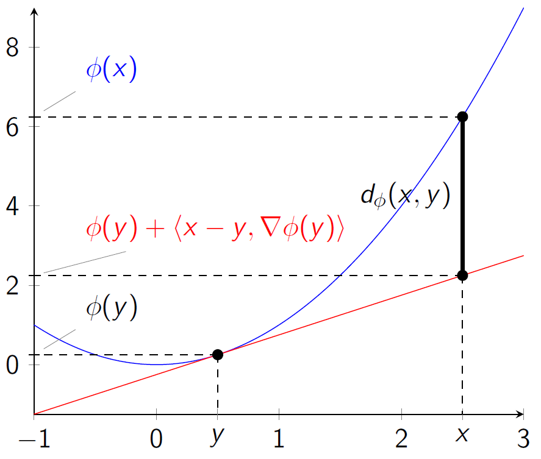]
]
---
## Bregman divergences [[Breman (1967)](https://www.sciencedirect.com/science/article/abs/pii/0041555367900407)]<hbr> .subtitle[&nbsp; Step K]<hbr>
### Mean minimizer property [[Banerjee et al. (2005)](https://www.jmlr.org/papers/v6/banerjee05b.html)]<h1br>

-----
If $U$ is a random variable defined on an open subset $\mathcal{O}\subset\mathbb{R}^d$, then
$$\mathbb{E}[U]=\arg\min_{x\in\mathcal{O}}\mathbb{E}[d_{\phi}(U,x)]$$
for any index function $\phi$.

-----

### Remark

- If $\phi = \|.\|_2^2\Rightarrow d_{\phi}(x,y)=\|x-y\|_2^2$: back to variance case.

- It is a motivation for K-means algorithm.

- Moreover, ...
---
## Exponential families<hbr> .subtitle[&nbsp; Still step K]<h0br>
### Definition<h1br>
------
$X$ is a member of an exponential family $\mathcal{E}_{\psi}$ if

$$f(x|\theta)=h(x)\exp(\langle\theta,T(x)\rangle-\psi(\theta)), \theta\in\Theta$$

-----
- An exponential family is said to be .stress[regular] if 
  - $T$ is not redundant : $\nexists \alpha\neq0: \langle \alpha,T(x)\rangle=$ constant $\forall x$
  - $\Theta$ is open.<h0br>

### Theorem [[Banerjee et al. (2005)](https://www.jmlr.org/papers/v6/banerjee05b.html)]<h1br>
-----
If $X$ is a member of a .stress[regular] exponential family $\mathcal{E}_{\psi}$ and if $\phi$ is the convex conjugate of $\psi$ defined by $\phi(x)=\sup_{y}\{\langle x,y\rangle-\psi(y)\}$, then there exists a unique Bregman divergence $d_{\phi}$ such that
$$f(x|\theta)=h(x)\exp(-d _{\phi}(T(x),\mathbb{E}[T(X)])+\phi(T(x)))$$

-----

---
class: left, top

## Candidate models<hbr> .subtitle[&nbsp; Step F]<hbr>

- For each Bregman divergence, simple models are fitted on all clusters in .stress[Step F].

  - Linear regression (regression)
  
  - Logistic regression (classification)
  
  - ...

------

.fl.w-10.pa2.f6[
<br>
<br>
.stress[Step K]
<br>
<br>
<br>
<br>
<br>
<br>
<br>

.stress[Step F]

]

.fl.w-30.pa2.f6[
```{r, ref.label='k1', echo=FALSE, fig.align='center', fig.width=3, fig.height=2.04}
```

<br>

$$\underbrace{\{\mathcal{M}_{1,1},\mathcal{M}_{1,2},\mathcal{M}_{1,3}\}}_{\mathcal{M}_1}$$

]

.fl.w-30.pa2.f6[

```{r , ref.label='k2', echo=FALSE, fig.align='center', fig.width=3, fig.height=2.04}

```

<br>

$$\underbrace{\{\mathcal{M}_{2,1},\mathcal{M}_{2,2},\mathcal{M}_{2,3}\}}_{\mathcal{M}_2}$$
]

.fl.w-30.pa2.f6[

```{r, ref.label='k3', echo=FALSE, fig.align='center', fig.width=3, fig.height=2.04}

```

<br>

$$\underbrace{\{\mathcal{M}_{3,1},\mathcal{M}_{3,2},\mathcal{M}_{3,3}\}}_{\mathcal{M}_3}$$ 

]

<br>
<br>
<br>
<br>
<br>
<br>
<br>

--------
<br>
<br>
<br>

<h1br>

--------

---
exclude: true
## Candidate models<hbr> .subtitle[&nbsp; Step F]<hbr>
- .stress[Step K] : .stress[K-means] with $M$ options of Bregman divergences $\mathcal{B}_m, m=1,...,M$, are implemented. We then have $M$ partition structures of in put data:
$$\mathcal{C}_1,...,\mathcal{C}_M$$
where $\mathcal{C}_m=\{C_{m,1},...,C_{m,K}\}$ is the partition corresponding to $\mathcal{B}_m$.

- .stress[Step F] : fit simple local model on each obtained cluster.

  - Linear regression (regression)
  
  - Logistic regression (classification)
  
  - ...
  
  We then have $M$ candidate models: $$\mathcal{M}_1, ..., \mathcal{M}_M$$
  where $\mathcal{M}_m=\{\mathcal{M}_{m,1},...,\mathcal{M}_{m,K}\}$ with $\mathcal{M}_{m,k}$ built on $C_{m,k}$.

---
## Combining methods<hbr> .subtitle[&nbsp; Step C]<hbr>
### Classification
- Example: binary classification
  - With $4$ classifiers $(\mathcal{M}_1,\mathcal{M}_2,\mathcal{M}_3,\mathcal{M}_4)$
  - New observation $x$ with predicted classes : $(\mathcal{M}_1,\mathcal{M}_2,\mathcal{M}_3,\mathcal{M}_4)=$ (.red[1,1,0,1]).

| $i$ | $\mathcal{M}_1$| $\mathcal{M}_2$ | $\mathcal{M}_3$ | $\mathcal{M}_4$ | $Y$ |
|------|-------------|--------------|-----------------------------|-----
| $1$ | 0 | 1 | 0 | 1 | 0 |
| .bo[.blue[2]] | .red[1] | .red[1] | .red[0] | .red[1] | .bo[.blue[1]] |
| $3$ | 1 | 0 | 0 | 1 | 1 |
| .bo[.blue[4]] | .red[1] | .red[1] | .red[0] | .red[1] | .bo[.blue[0]] |
| .bo[.blue[5]] | .red[1] | .red[1] | .red[0] | .red[1] | .bo[.blue[1]] |


- [Mojirsheibani (1999)](https://www.tandfonline.com/doi/abs/10.1080/01621459.1999.10474154) : majority vote.

- [Mojirsheibani (2000)](https://www.tandfonline.com/doi/abs/10.1080/01621459.1999.10474154) : weighted vote i.e., $\hat{y}=\mathbb{1}_{\{\sum_i Y_iW_i(x)>1/2\}}$.

---
class: left, top
## Combining methods<hbr> .subtitle[&nbsp; Step C]<hbr>
### Regression<hbr>
.fl.w-50.pa2.f6[

- Example: $M=4$ & $(r_1,r_2,r_3,r_4)$

| $i$ | $r_1$| $r_2$ | $r_3$ | $r_4$ | $Y$ |
|------|-------------|--------------|-----------------------------|------
| $1$ | $r_1(X_1)$ | $r_2(X_1)$ | $r_3(X_1)$ | $r_4(X_1)$ | $Y_1$ |
| $2$ | $r_1(X_2)$ | $r_2(X_2)$ | $r_3(X_2)$ | $r_4(X_2)$ | $Y_2$ |
| $\vdots$ | $\vdots$ | $\vdots$ | $\vdots$ | $\vdots$ | $\vdots$ |
| $n$ | $r_1(X_n)$ | $r_2(X_n)$ | $r_3(X_n)$ | $r_4(X_n)$ | $Y_n$ |
  
- Form: weighted average

$$\hat{y}=\sum_{i=1}^{n}W_{n,i}(x)Y_i.$$
- Let ${\bf r}(x)=(r_1(x), ... ,r_M(x))\in\mathbb{R}^M$

]


.fl.w-50.pa2.f6[
- [Biau et al. (2016)](https://www.sciencedirect.com/science/article/pii/S0047259X15000950):

$$W_{n,i}(x)=\frac{\prod_{m=1}^M\mathbb{1}_{\{|r_{m}(x)-r_{m}(X_i)|<h\}}}{\sum_{j=1}^{n}\prod_{m=1}^M\mathbb{1}_{\{|r_{m}(x)-r_{m}(X_j)|<h\}}}$$

- [Has (2021)](https://hal.archives-ouvertes.fr/hal-02884333v5):

$$W_{n,i}(x)=\frac{K_h({\bf r}(x)-{\bf r}(X_i))}{\sum_{j=1}^{n}K_h({\bf r}(x)-{\bf r}(X_j))}$$
- [Fischer and Mougeot (2019)](https://www.sciencedirect.com/science/article/pii/S0378375818302349):

$$W_{n,i}(x)=\frac{K_{\alpha, \beta}(x-X_i,{\bf r}(x)-{\bf r}(X_i))}{\sum_{j=1}^{n}K_{\alpha, \beta}(x-X_j,{\bf r}(x)-{\bf r}(X_j))},$$
with the convention $0/0=0$.
]

---
class: left, top

## KFC Procedure<hbr> .subtitle[&nbsp; A bit more]<hbr>

- $\mathcal{D}_n=\mathcal{D}_k\cup\mathcal{D}_{\ell}$.

- .stress[Step K] and .stress[F] are based only on $\mathcal{D}_k$, and .stress[Step C] is done based on $\mathcal{D}_{\ell}$.

------

.fl.w-10.pa2.f6[
<br>
<br>
.stress[Step K]
<br>
<br>
<br>
<br>
<br>
<br>
<br>

.stress[Step F]

<br>
<br>
<br>
.stress[Step C]
]

.fl.w-30.pa2.f6[
```{r, ref.label='k1', echo=FALSE, fig.align='center', fig.width=3, fig.height=2.04}
```

<br>

$$\underbrace{\{\mathcal{M}_{1,1},\mathcal{M}_{1,2},\mathcal{M}_{1,3}\}}_{\mathcal{M}_1}$$

]

.fl.w-30.pa2.f6[
```{r, ref.label='k2', echo=FALSE, fig.align='center', fig.width=3, fig.height=2.04}
```

<br>

$$\underbrace{\{\mathcal{M}_{2,1},\mathcal{M}_{2,2},\mathcal{M}_{2,3}\}}_{\mathcal{M}_2}$$

<br>
<h1br>

.center[.stress[Combining]] 
$$(\mathcal{M}_1, \mathcal{M}_2, \mathcal{M}_3)$$
]

.fl.w-30.pa2.f6[
```{r, ref.label='k3', echo=FALSE, fig.align='center', fig.width=3, fig.height=2.04}
```

<br>

$$\underbrace{\{\mathcal{M}_{3,1},\mathcal{M}_{3,2},\mathcal{M}_{3,3}\}}_{\mathcal{M}_3}$$ 

]

<br>
<br>
<br>
<br>
<br>
<br>
<br>

--------
<br>
<br>
<br>

<h1br>

--------

---
## Numerical experiment<hbr> .subtitle[&nbsp; Brerman divergences]

- Recall:

$$
d_{\phi}(x,y)=\phi(x)-\phi(y)-\langle x-y,\nabla\phi(y)\rangle
$$

.center[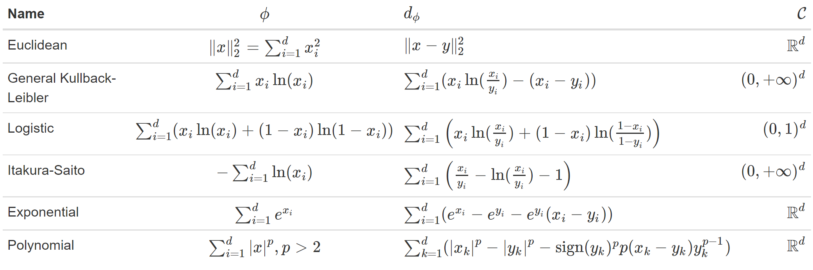]

- Only some are selected for numerical experiments.

---
## Numerical experiment<hbr> .subtitle[&nbsp; K-means on simulated data]<hbr>

```{r kmeans, echo=FALSE, fig.align='center', fig.width=11, fig.height=2.2}
df_norm <- read_delim("./data/df_norm.txt",
                 col_names = TRUE,
                 delim = " ",
                 show_col_types = FALSE)
df_pois <- read_delim("./data/df_pois.txt",
                 col_names = TRUE,
                 delim = " ",
                 show_col_types = FALSE)
df_exp <- read_delim("./data/df_exp.txt",
                 col_names = TRUE,
                 delim = " ",
                 show_col_types = FALSE)
fig1 <- plotly::plot_ly(df_norm,
                x = ~x1,
                y = ~x2,
                showlegend = FALSE)

fig10 <- fig1 %>%
  plotly::add_markers(size = I(10)) %>%
  plotly::layout(title = list(text = "Gaussian distribution",
                      y = 0.95))

fig11 <- fig1 %>%
  plotly::add_markers(color = ~as_factor(color_euc),
              size = I(10))
fig12 <- fig1 %>%
  plotly::add_markers(color = ~as_factor(color_gkl),
              size = I(10))
fig13 <- fig1 %>%
  plotly::add_markers(color = ~as_factor(color_poly5),
              size = I(10))
fig14 <- fig1 %>%
  plotly::add_markers(color = ~as_factor(color_ita),
              size = I(10)) %>%
  plotly::layout(title = list(text = "Gaussian distribution       Euclidean                  GKL                      Polynomial5          Itakura-Saito",
                      y = 0.95))

fig2 <- plotly::plot_ly(df_pois,
                x = ~x1,
                y = ~x2,
                showlegend = FALSE)

fig20 <- fig2 %>%
  plotly::add_markers(size = I(10))
fig21 <- fig2 %>%
  plotly::add_markers(color = ~as_factor(color_euc),
              size = I(10))
fig22 <- fig2 %>%
  plotly::add_markers(color = ~as_factor(color_gkl),
              size = I(10))
fig23 <- fig2 %>%
  plotly::add_markers(color = ~as_factor(color_poly5),
              size = I(10))
fig24 <- fig2 %>%
  plotly::add_markers(color = ~as_factor(color_ita),
              size = I(10)) %>%
  plotly::layout(title = list(text = "Poison distribution          Euclidean                  GKL                      Polynomial5           Itakura-Saito",
                      y = 0.95))

fig3 <- plotly::plot_ly(df_exp,
                x = ~x1,
                y = ~x2,
                showlegend = FALSE)

fig30 <- fig3 %>%
  plotly::add_markers(size = I(10))
fig31 <- fig3 %>%
  plotly::add_markers(color = ~as_factor(color_euc),
              size = I(10))
fig32 <- fig3 %>%
  plotly::add_markers(color = ~as_factor(color_gkl),
              size = I(10))
fig33 <- fig3 %>%
  plotly::add_markers(color = ~as_factor(color_poly5),
              size = I(10))
fig34 <- fig3 %>%
  plotly::add_markers(color = ~as_factor(color_ita),
              size = I(10)) %>%
  plotly::layout(title = list(text = "Exponential distribution  Euclidean                  GKL                      Polynomial5          Itakura-Saito",
                      y = 0.95))

plotly::subplot(fig10, fig11, fig12, fig13, fig14, nrows = 1)
plotly::subplot(fig20, fig21, fig22, fig23, fig24, nrows = 1)
plotly::subplot(fig30, fig31, fig32, fig33, fig34, nrows = 1)
```


---
## Numerical experiment<hbr> .subtitle[&nbsp; Simulated data (classification)]<hbr>
.center[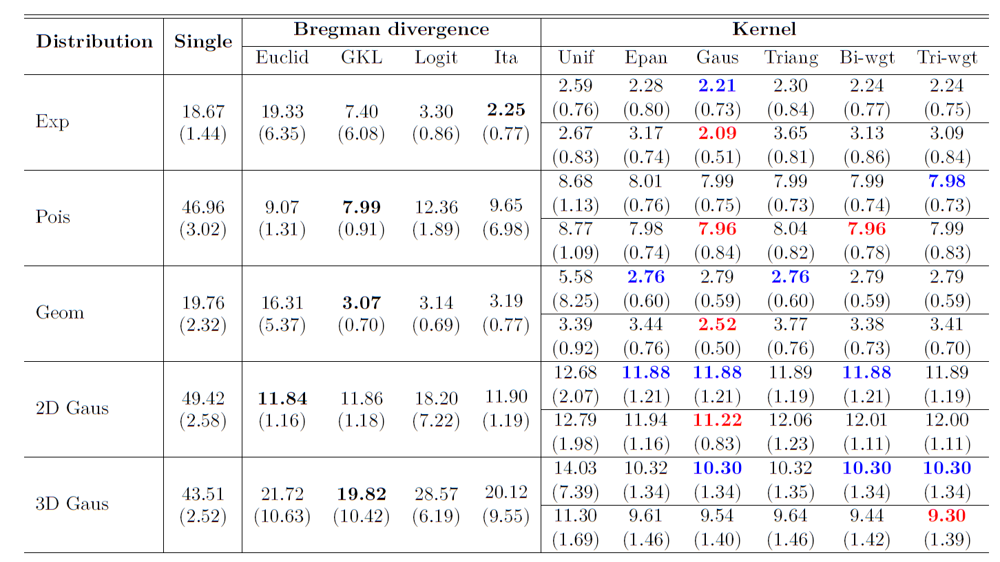]

- Average misclassication errors over 20 runs, unit = $10^{-2}$.
- First row: aggregation without input [[Mojirsheibani (1999)](https://www.tandfonline.com/doi/abs/10.1080/01621459.1999.10474154) and [(2000)](https://www.tandfonline.com/doi/abs/10.1080/01621459.1999.10474154)].
- Second row: aggregation with input [[Fischer and Mougeot (2019)](https://www.sciencedirect.com/science/article/pii/S0378375818302349)].

---
## Numerical experiment<hbr> .subtitle[&nbsp; Simulated data (regression)]<hbr>
.center[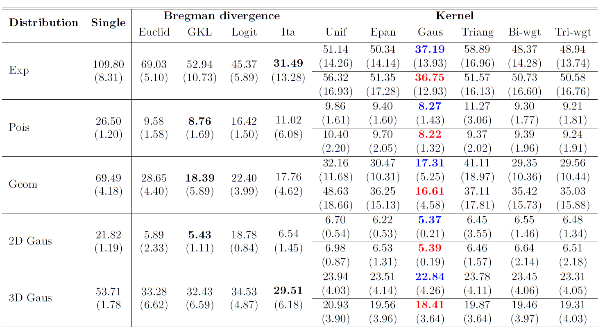]

- Average RMSEs over 20 runs.
- First row: aggregation without input [[Biau et al. (2016)](https://www.sciencedirect.com/science/article/pii/S0047259X15000950) and [Has (2021)](https://hal.archives-ouvertes.fr/hal-02884333v5)].
- Second row: aggregation with input [[Fischer and Mougeot (2019)](https://www.sciencedirect.com/science/article/pii/S0378375818302349)].

---
## Application<hbr> .subtitle[&nbsp; Real data (Air compressor machine [[Cadet et al., (2005)](https://www.researchgate.net/publication/285367508_Monitoring_energy_performance_of_compressors_with_an_innovative_auto-adaptive_approach)])]<hbr>
.fl.w-40.pa2.f6[
- Five predictors: air temperature, input pressure, output pressure, flow  and water temperature.

- Response variable: power consumption.

.center[]

- $Comb_3^R$ and $Comb_2^R$ stand combining method with and without input respectively.

- $K$ is not available!
]
.fl.w-60.pa2.f6[
.center[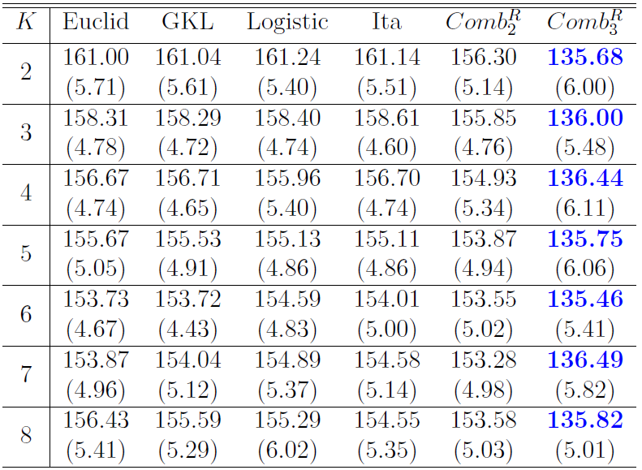]
.center[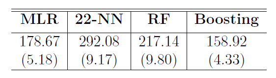]
]
---
## Application<hbr> .subtitle[&nbsp; Real data (Wind turbine of Maïa Eolis [[Fischer et al., 2017](https://hal.archives-ouvertes.fr/hal-01373429v2)])]<hbr>
.fl.w-40.pa2.f6[
- Six predictors: wind speed (real part, imaginary part, and strength),
wind direction (sine and cosine) and temperature.

- Response variable: power.

.center[]

- Same here, $K$ is not available!
]
.fl.w-60.pa2.f6[
.center[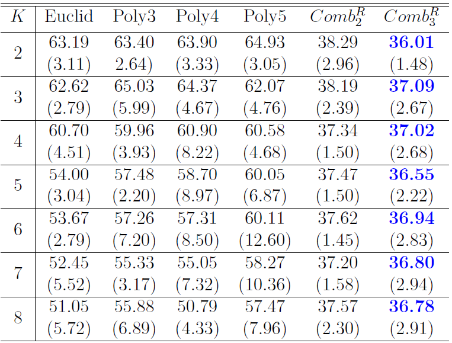]
.center[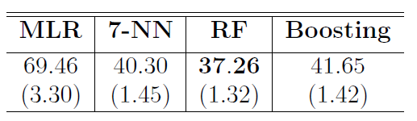]
]

---
## Source codes and documentation<hbr> .subtitle[&nbsp; [Has et al. (2021)](https://www.tandfonline.com/doi/full/10.1080/00949655.2021.1891539) Published in *Journal of Statistical Computation and Simulation*]<hbr>

- GitHub `r fontawesome::fa("github")` : [https://github.com/hassothea/KFC-procedure](https://github.com/hassothea/KFC-procedure).

- Documentation : [https://hassothea.github.io/files/CodesPhD/KFCReg.html](https://hassothea.github.io/files/CodesPhD/KFCReg.html).
<iframe width='720px' height='370px' src='https://hassothea.github.io/files/CodesPhD/KFCReg.html' >
  <p>KFC-Procedure documentation</p>
</iframe>

???

- Extreme input data 'leverage', KFC works!

---
template: inter-slide
class: left, middle, inverse
count: false
## `r fontawesome::fa("map", fill="rgba(83, 202, 95, 0.696);")` .section[Outline]

#### I. KFC procedure : clusterwise prediction via aggregation of distances

#### .section[II. A kernel-based consensual aggregation for regression]

#### III. Aggregation on randomly projected high-dimensional features for regression

---
## .darkgreen[Notation]

- $\mathcal{Y} = \mathbb{R}$ : output space

- $\mathcal{D}_{n}$ is partitioned into $\mathcal{D}_k=\{(X_i^{(k)},Y_i^{(k)})_{i=1}^k\}$ and $\mathcal{D}_{\ell}=\{(X_i^{(\ell)},Y_i^{(\ell)})_{i=1}^{\ell}\}$

- ${\bf r}_k=(r_{k,1},...,r_{k,M})$: $M$ regression estimators constructed using $\mathcal{D}_k$ 

- $g^*(x)=\mathbb{E}(Y|X=x)$ : Regression function

- $g^*({\bf r}_k(x))=\mathbb{E}(Y|X={\bf r}_k(x))$.

- Quadratic risk : $\mathcal{R}(f)=\mathbb{E}(|f(X)-g^*(X)|^2)$

.center[

| $i$ | $r_{k,1}$| $r_{k,2}$ | $\dots$ | $r_{k,M}$ | $Y$ |
|------|-------------|--------------|-----------------------------|------
| $1$ | $r_{k,1}(X_1^{(\ell)})$ | $r_{k,2}(X_1^{(\ell)})$ | $\dots$ | $r_{k,M}(X_1^{(\ell)})$ | $Y_1^{({\ell})}$ |
| $\vdots$ | $\vdots$ | $\vdots$ | $\vdots$ | $\vdots$ | $\vdots$ |
| $\ell$ | $r_{k,1}(X_\ell^{(\ell)})$ | $r_{k,2}(X_\ell^{(\ell)})$ | $\dots$ | $r_{k,M}(X_\ell^{(\ell)})$ | $Y_\ell^{({\ell})}$ |

]

---
## The aggregation method<hbr>
- Form : $$g_n({\bf r}_k(x))=\sum_{i=1}^{\ell}W_{n,i}(x)Y_i^{\ell}=\sum_{i=1}^{\ell}\frac{K_h({\bf r}(x)-{\bf r}(X_i^{(\ell)}))}{\sum_{j=1}^{\ell}K_h({\bf r}(x)-{\bf r}(X_j^{(\ell)}))}Y_i^{\ell},$$
where $K_h(x)=K(x/h)$ for some $h>0$ with the convention of $0/0=0$.

.fl.w-60.pa2.f6[
- Regular kernel $K:\mathbb{R}^d\to\mathbb{R}_+$ satisfying:
  - $\exists b,\kappa_0,\rho>0: \forall x\in\mathbb{R}^M: b\mathbb{1}_{B_M(0,\rho)}(x)\leq K(x)\leq 1$
	-	$\int_{\mathbb{R}^M}\sup_{u\in B_M(x,\rho)}K(u)dx = \kappa_0 < +\infty$
	
- [Biau et al. (2016)](https://www.sciencedirect.com/science/article/pii/S0047259X15000950) :<h1br>

$$W_{n,i}(x)=\frac{\prod_{m=1}^M\mathbb{1}_{\{|r_{k,m}(x)-r_{k,m}(X_i^{(\ell)})|<h\}}}{\sum_{j=1}^{\ell}\prod_{m=1}^M\mathbb{1}_{\{|r_{k,m}(x)-r_{k,m}(X_j^{(\ell)})|<h\}}}$$
]

.fl.w-40.pa2.f6[
.top[
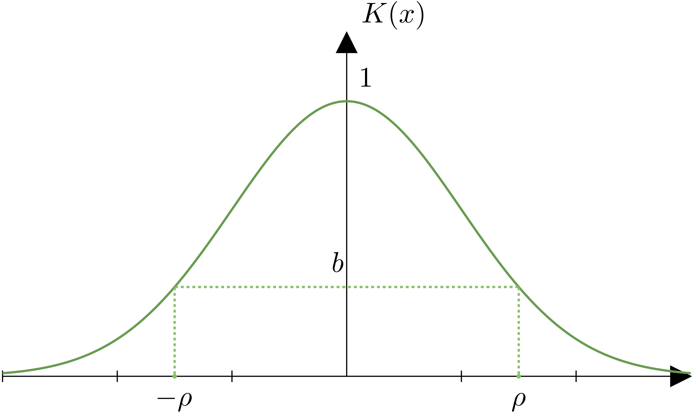
]
]
</h1br>

---
## Theoretical performance<hbr>
### Proposition 1<h1br>

-----
Let $\textbf{r}_k=(r_{k,1},r_{k,2},...,r_{k,M})$ be the collection of all basic estimators and $g_n(\textbf{r}_k(x))$ be the combined estimator computed at point $x\in\mathbb{R}^d$. Then, for all distributions of $(X,Y)$ with $\mathbb{E}[|Y|^2]< +\infty$, 

$$\mathbb{E}[|g_n({\bf r}_k(X))-g^*(X)|^2]\leq \inf_{f\in\mathcal{G}}\mathbb{E}[|f({\bf r}_k(X))-g^*(X)|^2]\\
\quad \quad \quad \quad \quad \quad \quad \quad \quad \quad \quad \quad \quad +\mathbb{E}[|g_n({\bf r}_k(X))-g^*({\bf r}_k(X))|^2],$$

where $\mathcal{G}=\{f:\mathbb{R}^M\to\mathbb{R}:\mathbb{E}[|f(\textbf{r}_k(X))|^2]<+\infty\}$.
In particular,

$$\mathbb{E}\Big[|g_n({\bf r}_k(X))-g^*(X)|^2\Big]\leq \min_{1\leq m\leq M}\mathbb{E}[|r_{k,m}(X)-g^*(X)|^2]\\
\quad \quad \quad \quad \quad \quad \quad \quad \quad \quad \quad \quad \quad +\mathbb{E}[|g_n({\bf r}_k(X))-g^*({\bf r}_k(X))|^2].$$

-----

???

- First term : bias and cannot be controlled.

- Second term : variance term to be controlled.

---
## Theoretical performance<hbr>
### Proposition 2<h1br>

-----
Assume that all the estimators $r_{k,1},...,r_{k,M}$ are bounded. Let $h\rightarrow0$ and $\ell\rightarrow+\infty$ such that $h^M\ell\to+\infty$. Then

$$\mathbb{E}\Big[|g_n(\textbf{r}_k(X))-g^*(\textbf{r}_k(X))|^2\Big]\rightarrow0\ \text{as }\ell\rightarrow+\infty$$
for all distribution of $(X,Y)$ s.t $\mathbb{E}[|Y|^2]<+\infty$. Thus,

$$\limsup_{\ell\rightarrow+\infty}\mathbb{E}\Big[|g_n(\textbf{r}_k(X))-g^*(X)|^2\Big]\leq\inf_{f\in\mathcal{G}}\mathbb{E}\Big[|f(\textbf{r}_k(X))-g^*(X)|^2\Big].$$
And in particular,
$$\limsup_{\ell\rightarrow+\infty}\mathbb{E}\Big[|g_n(\textbf{r}_k(X))-g^*(X)|^2\Big]\leq\min_{1\leq m \leq M}\mathbb{E}\Big[|r_{k,m}(X)-g^*(X)|^2\Big].$$

-----

???

- No information about rate of convergence

---
## Theoretical performance<hbr>
### Theorem<h1br>

-----
Assume that 
- $Y$ and all the basic machines $r_{k,m},m=1,2,...,M$, are bounded by $R$
- $\exists  L>0,\forall k\geq 1$: $|g^*({\bf r}_k(x))-g^*({\bf r}_k(y))|\leq L\|{\bf r}_k(x)-{\bf r}_k(y)\|,\forall x,y\in\mathbb{R}^d.$
- $\exists R_K,C_K>0$: $K(z)\leq C_Ke^{-\|z\|^{\alpha}/\sigma}, \forall z\in\mathbb{R}^M\ \text{s.t }\|z\|\geq R_K$, $\alpha,\sigma>0$.

Then, with the choice of $h\propto \ell^{-\frac{1}{M+2}}$, there exists $C>0$ such that
$$\mathbb{E}[|g_n({\bf r}_k(X))-g^*(X)|^2]\leq \min_{1\leq m\leq M}\mathbb{E}[|r_{k,m}(X)-g^*(X)|^2]+C\ell^{-\frac{2}{M+2}}.$$

-----

- Consequently, we have .stress[consistency inheritance property] :

$$\Big[\exists m_0:\mathcal{R}(r_{k,m_0})\xrightarrow[k\to+\infty]{} 0\Big]\Rightarrow \Big[\mathcal{R}(g_n({\bf r}_k(.)))\xrightarrow[k,\ell\to+\infty]{}0\Big]$$


???

---
## Optimization algorithm<hbr> .subtitle[&nbsp; Gradient descent]<hbr>
.fl.w-60.pa2.f6[
- Observation :
.center[
```{r err, echo=FALSE, fig.align='center', fig.width=5.5, fig.height=4}
x <- seq(0.1, 5, length.out = 200)
y <- -exp(-x)*log(x^20) + 4
x_m <- 1.763
y_m <- -exp(-x_m)*log(x_m^20) + 4

df_ <- tibble::tibble(error = y,
                       parameter = x)
plotly::plot_ly(df_,
                x = ~parameter,
                y = ~error,
                showlegend = FALSE) %>%
  plotly::add_lines() %>%
  plotly::add_lines(x = x_m,
                    colors = "red") %>%
  plotly::add_markers(x = x_m,
                      y = y_m) %>%
  plotly::layout(scene = list(aspectration=list(x=1,y=1)))
```
]
- Objective function : $\kappa$-fold cross-validation error:
$$\varphi^{\kappa}(h)=\frac{1}{\kappa}\sum_{p=1}^{\kappa}\sum_{(X_j,Y_j)\in F_p}[g_n(\textbf{r}_k(X_j))-Y_j]^2,$$
where $g_n(\textbf{r}_k(X_j))=\sum_{(X_i,Y_i)\in \mathcal{D}_{\ell}\setminus F_p}W_{n,i}(X_j)Y_i$.

]

.fl.w-40.pa2.f6[
- The differentiability of $\varphi$ depends entirely on $K$.

- .stress[Algorithm]

-----
  - `Init`: $h_0,\lambda,\delta>0,N$.
  - `for` $k=1,2,...,N$: 
  
    `while` $\Big|\frac{d}{d h}\varphi^{\kappa}(h_{k-1})\Big|>\delta$ `do`: 
$$h_k\gets h_{k-1}-\lambda\frac{d}{d h}\varphi^{\kappa}(h_{k-1})$$

  - `return` : $h_k$ violating the `while` condition or $h_N$.

----
]

---
## Numerical experiment<hbr> .subtitle[&nbsp; Simulated data]<hbr>
- Uncorrelated case : $X\sim\mathcal{U}[-1,1]^d$, average RMSEs over $100$ runs.
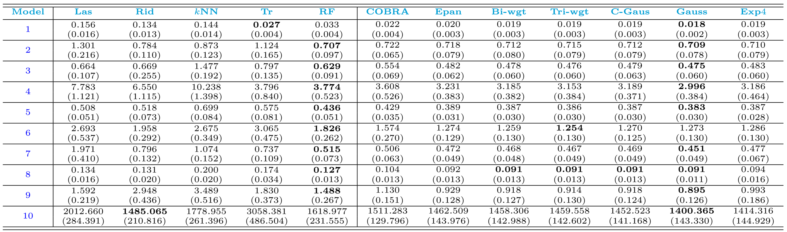

- Uncorrelated case : $X\sim\mathcal{N}_d(0, \Sigma)$ with $\Sigma_{ij}=2^{-|i-j|}$.
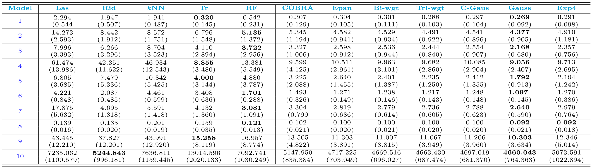

---
## Numerical experiment<hbr> .subtitle[&nbsp; Real data]<hbr>
- **House**, **Wine**, **Abalone** are public data. **Air** and **Turbine** are private.

.center[

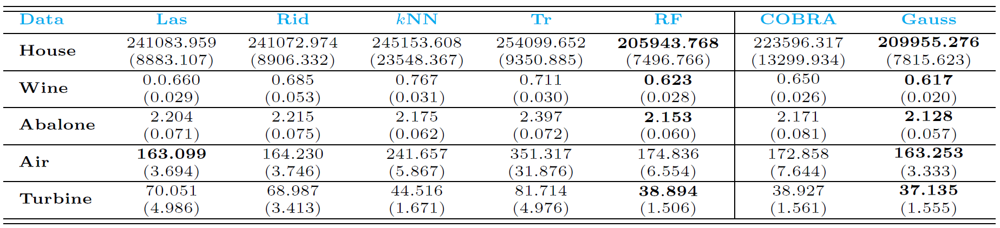

]

- Computational time on **Turbine** and **Wine** datasets.
.center[

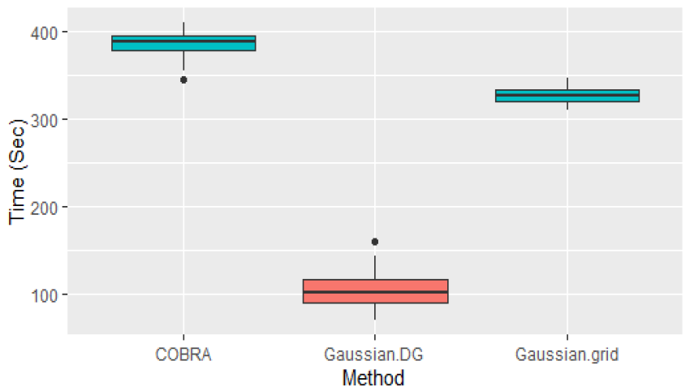
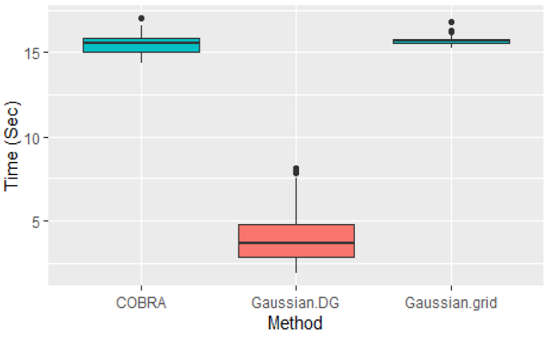

]

---
## Application on Physics data<hbr> .subtitle[&nbsp; Provided by researchers of CAE [[Kluth et al. (2022)](https://www.frontiersin.org/articles/10.3389/fphy.2022.786639/full)]]<hbr>
- Predictors : $L$, $\alpha$, and $\log(E)$. Response variable :  $D_{\alpha, \alpha}$.
.center[

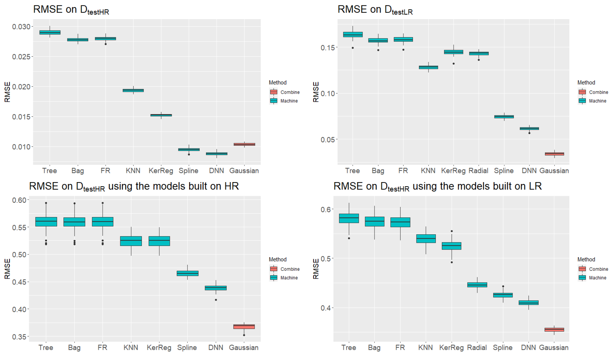

]

---
## Source codes and documentation<hbr> .subtitle[&nbsp; Under review and available in *HAL* [[Has (2021)](https://hal.archives-ouvertes.fr/hal-02884333v5)]]<hbr>

- GitHub `r fontawesome::fa("github")` : [https://github.com/hassothea/AggregationMethods](https://github.com/hassothea/AggregationMethods).

- Documentation : [https://hassothea.github.io/files/CodesPhD/KernelAggReg.html](https://hassothea.github.io/files/CodesPhD/KernelAggReg.html).
<iframe width='720px' height='370px' src='https://hassothea.github.io/files/CodesPhD/KernelAggReg.html' >
  <p>Kernel Aggregation documentation</p>
</iframe>

???

- Extreme input data 'leverage', KFC works!

---
template: inter-slide
class: left, middle, inverse
count: false
## `r fontawesome::fa("map", fill="rgba(83, 202, 95, 0.696);")` .section[Outline]

#### I. KFC procedure : clusterwise prediction via aggregation of distances

#### II. A kernel-based consensual aggregation for regression

#### .section[III. Aggregation on randomly projected high-dimensional features for regression]

---
exclude: true 
## Some studies

.fl.w-50.pa2.f6[
### .darkgreen[Classification]
$$g_n({\bf c}(x))=\text{arg}\max_{1\leq k\leq N}\sum_{i=1}^{\ell}W_{n,i}(x)\mathbb{1}_{\{Y_i^{(\ell)}=k\}}.$$

- [Mojirsheibani (1999)](https://www.tandfonline.com/doi/abs/10.1080/01621459.1999.10474154):

$$W_{n,i}(x)=\mathbb{1}_{\{{\bf c}(x)={\bf c}(X_i^{(\ell)})\}}$$

- [Mojirsheibani (2016)](https://www.sciencedirect.com/science/article/abs/pii/S0167715216301304):
$$W_{n,i}(x)=K_h(d_\mathcal{H}({\bf c}(x),{\bf c}(X_i^{(\ell)})))$$
where
  - $d_\mathcal{H}$ : Hamming distance
  - $K_h(x)=K(x/h)$ for some $h>0$
  - with convention $0/0 = 0$
]

--
exclude: true 
.fl.w-50.pa2.f6[
### .darkgreen[Regression]

$$g_n({\bf r}(x))=\sum_{i=1}^{\ell}W_{n,i}(x)Y_i^{(\ell)}.$$

- [Biau et al. (2016)](https://www.sciencedirect.com/science/article/pii/S0047259X15000950):

$$W_{n,i}(x)=\frac{\prod_{m=1}^M\mathbb{1}_{\{|r_{k,m}(x)-r_{k,m}(X_i^{(\ell)})|<h\}}}{\sum_{j=1}^{\ell}\prod_{m=1}^M\mathbb{1}_{\{|r_{k,m}(x)-r_{k,m}(X_j^{(\ell)})|<h\}}}$$

- [Has (2021)](https://hal.archives-ouvertes.fr/hal-02884333v5):

$$W_{n,i}(x)=\frac{K_h({\bf r}(x)-{\bf r}(X_i^{(\ell)}))}{\sum_{j=1}^{\ell}K_h({\bf r}(x)-{\bf r}(X_j^{(\ell)}))}$$
]


???

- Une idée clé de la prédiction est d'identifier le voisin du point de données dans l'espace d'entrée. C'est la même pour aggregation consenseille, sauf que les voisons sont en sense de predictions.

- La classe prédite est la classe avec le poids le plus lourd.

- Pour predire un classe de point $x$, on cherche pour tout les points $x_i$ de donnée apprentisage avec la même préditions que $x$. 

---
exclude: true 
## .darkgreen[Consistency Inheritence Property (CIP)]

.fl.w-50.pa2.f6[
### .darkgreen[Classification]

- Loss: $\ell(x,y)=\mathbb{1}_{\{x\neq y\}}$

- Risk: $\mathcal{R}_{\bf c}(f)=\mathbb{P}(f(X)\neq Y)$

- Result: for any basic classifier $c_{k,m}$,

$$\lim_{k,\ell\to+\infty}\sup\{\mathcal{R}_{\bf c}(g_n({\bf c}(.))-\mathcal{R}_{\bf c}(c_{k,m}(.))\}\leq0.$$
- In particular, 

$$\exists c_{k,m_0}\text{ consistent }\Rightarrow\text{ so is }g_n({\bf c}(.)).$$
<br>
<br>
<br>
<br>
<br>
]

--
exclude: true 
.fl.w-50.pa2.f6[
### .darkgreen[Regression]

- Loss: $\ell(x,y)=(x- y)^2$

- Risk: $\mathcal{R}_{\bf r}(f)=\mathbb{E}[(f(X)- Y)^2]$

- Let $\eta(x)=\mathbb{E}(Y|X=x)$ be the regression function, and

$$\mathcal{R}_{\bf r}(f,\eta)=\mathbb{E}[(f(X)-\eta(X))^2].$$
- Result: 

$$\mathcal{R}_{\bf r}(g_n({\bf r}(.)),\eta) \leq 
\min_{1\leq m\leq M}\mathcal{R}_{\bf r}(r_{k,m},\eta)+\mathcal{V}_{\ell}.$$

- In particular, 

$$\exists r_{k,m_0}\text{ consistent }\Rightarrow\text{ so is } g_n({\bf r}(.)).$$
]

---
## Motivation

- .stress[high-dimension] refers to .stress[the number of basic estimators] $M$.

- Consistency inheritance property.

- Practical performance of the aggregation method on large lists.

- A dimensional reduction is needed.

- Prediction matrix : ${\bf r}_k(\mathcal{X})\in\mathbb{R}^{\ell\times M}$.

.center[

| $r_{k,1}$| $r_{k,2}$ | $\dots$ | $r_{k,M}$ |
|----------|-----------|---------|-----------|
| $r_{k,1}(X_1)$ | $r_{k,2}(X_1)$ | $\dots$ | $r_{k,M}(X_1)$ |
| $\vdots$ | $\vdots$ | $\vdots$ | $\vdots$ | 
| $r_{k,1}(X_\ell)$ | $r_{k,2}(X_\ell)$ | $\dots$ | $r_{k,M}(X_\ell)$ |

]

???

- Some assumptions like Lipscitz condition is not verifiable.

- There are theory in classification that $M\to\infty$.

---
## Jonhson-Lindenstrauss Lemma (J-L)<hbr> .subtitle[&nbsp; Implementation]
- For any $m<M$, let $G=(G_{i,j})$ be an $M\times m$, with $G_{i,j}\sim\mathcal{N}(0,1/m)$ independent.

- Random projection:

$$\tilde{\bf r}_k(\mathcal{X})={\bf r}_k(\mathcal{X})\times G\quad\quad\quad\quad\quad\quad\quad\quad\quad\quad\quad\quad\quad\quad\quad\quad\quad\quad\quad\quad\quad\ \\
=\begin{pmatrix}
  r_{k,1}(X_1)  & \dots &  r_{k,M}(X_1) \\
   r_{k,1}(X_2)  & \dots &  r_{k,M}(X_2) \\
  \vdots & \ddots & \vdots \\
  r_{k,1}(X_\ell) & \dots &  r_{k,M}(X_\ell) \\
\end{pmatrix}\times
\begin{pmatrix}
  G_{11}  & \dots &  G_{1m} \\
  G_{21}  & \dots &  G_{2m} \\
  \vdots & \ddots & \vdots \\
  G_{M1}  & \dots &  G_{Mm} \\
\end{pmatrix}\\
\quad\ =\begin{pmatrix}
  \tilde{r}_1(X_{1})  & \tilde{r}_2(X_{1})   & \dots &  \tilde{r}_m(X_{1})  \\
  \tilde{r}_1(X_{2})  & \tilde{r}_2(X_{2})   & \dots &  \tilde{r}_m(X_{2})  \\
  \vdots & \vdots & \vdots & \vdots \\
  \tilde{r}_1(X_{\ell})  & \tilde{r}_2(X_{\ell})   & \dots &  \tilde{r}_m(X_{\ell})  \\
\end{pmatrix}_{\ell \times m}.\quad\quad\quad\quad\quad\quad\quad\quad$$

---
## .darkgreen[Jonhson-Lindenstrauss Lemma (J-L)]<hbr>
### .darkgreen[Lemma (Johnson-Lindenstrauss)]<hbr>
-----

Let $S_n = \{z_j\in\mathbb{R}^M:j=1,2,...,n\}$ denote a subset containing $n$ points of $\mathbb{R}^M$, $z_0\in\mathbb{R}^M$ fixed. Let $\tilde{z_0}$ and $\tilde{z_j}$ be the projected point of $z_0$ and $z_j$ respectively into $\mathbb{R}^m$ using the described random projection. Thus, for any $\delta\in(0,1)$, one has: 

$$\mathbb{P}\Big(\Big|\frac{\|\tilde{z_0}-\tilde{z_j}\|^2}{\|z_0-z_j\|^2}-1\Big|\leq \delta,\text{ for all } z_j\in S_n\Big)\geq 1-2n\exp(-m(\delta^2/2-\delta^3/3)/2).$$

------
<hbr>
.fl.w-50.pa2.f6[

```{r JL0, echo=FALSE, fig.align='left', fig.width=5, fig.height=3.5}
set.seed(111)
x <- runif(5,-5, 5)
y <- runif(5,-5, 5)
z <- runif(5, 2, 10)
M <- cbind(x, y, z)
G = matrix(rnorm(6, 0, 1/sqrt(2)), nrow = 3)
m <- M %*% G
df_ <- tibble::tibble(x = x,
                      y = y,
                      z = z,
                      x_ = m[,1],
                      y_ = m[,2],
                      col = as.factor(1:5))
fig0 <- plotly::plot_ly(as.data.frame(df_),
                x = ~x,
                y = ~y,
                z = ~z,
                showlegend = FALSE) %>%
  plotly::add_markers(color = ~col) %>%
  plotly::layout(title = list(text = "Original points",
                              x = 0.5,
                              y = 0.95))
fig0
```

]

.fl.w-50.pa2.f6[

```{r JL1, echo=FALSE, fig.align='left', fig.width=5, fig.height=3}
fig1 <- plotly::plot_ly(data.frame(x = m[,1],
                                   y = m[,2],
                                   col = as.factor(1:5)),
                        x = ~x,
                        y = ~y,
                        color = ~col,
                        showlegend = FALSE)%>%
  plotly::add_markers(size = I(100)) %>%
  plotly::layout(title = list(text = "Projected points",
                              x = 0.5,
                              y = 0.95))
fig1
```

]

---
## Aggregation scheme
- Two steps: .stress[projection] and .stress[aggregation].<br>
More precisely, for any $x\in\mathbb{R}^d$, 
$$g_n(\tilde{\bf r}_k(x))=\sum_{i=1}^{\ell}\frac{K_h(\tilde{\bf r}_k(x)-\tilde{\bf r}_k(X_i^{(\ell)}))}{\sum_{j=1}^{\ell}K_h(\tilde{\bf r}_k(x)-\tilde{\bf r}_k(X_j^{(\ell)}))}Y_i^{(\ell)},$$
where $K_h(x)=\exp(-\|x/h\|^{\alpha}/\sigma)$ for some $\alpha,\sigma$ and $h>0$.

<br>

.center[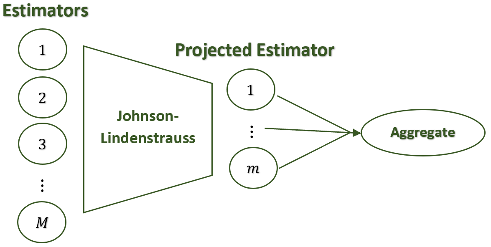]

???

- The result doesn't depend on $M$.

---
## Theoretical result

- Let $g_n({\bf r}(.))$ and $g_n(\tilde{\bf r}(.))$ be the aggregation using .stress[full] predicted features and .stress[projected] features respectively.

### Theorem<hbr>
------
Assume that all the regressors $r_1,r_2,...,r_M$ and the response variable $Y$ are bounded almost surely by $R_0$, thus for any $h,\varepsilon>0, n\geq1,$ and for any $\delta\in(0,1)$, with the choice of $m$ satisfying: $m\geq C_1\frac{\log[2/(1-\sqrt[n]{1-\delta})]}{h^{2\alpha}\varepsilon^2}$, with $C_1=3(2+\alpha)^2(2R_0)^{2(1+\alpha)}/\sigma^2$, one has:
$$
\mathbb{P}\Big(|g_n({\bf r}(X))-g_n(\tilde{\bf r}(X))|>\varepsilon\Big)\leq \delta.
$$

------

- For large $n$, the lower bound of $m$ is of order $O\Big(\frac{\log(2n/\delta)}{h^{2\alpha}\varepsilon^2}\Big)$.

???

- $m$ assez grand.

---
exclude: true 
## Theoretical result

- Let $g_n({\bf r}(.))$ and $g_n(\tilde{\bf r}(.))$ be the aggregation using .blue[full] and .blue[projected] features respectively.

## .darkgreen[Theorem]

Assume that all the regressors $r_1,r_2,...,r_M$ and the response variable $Y$ are bounded almost surely by $R_0$, thus for any $h,\varepsilon>0, n\geq1,$ and for any $\delta\in(0,1)$,
$$
\mathbb{P}\Big(|g_n(\textbf{r}(X))-g_n(\tilde{\textbf{r}}(X))|>\varepsilon\Big)\leq 1-\Big[1-2\exp\Big(-\frac{mh^{2\alpha}\varepsilon^2}{3R_1^{2}}\Big)\Big]^n
$$

---
## Numerical simulation<hbr> .subtitle[&nbsp; Basis regressors]<hbr>

- $k$NN, elastic net, bagging, random forest, boosting.

- $200$ values of parameter each $\Rightarrow M=1000$ (very highly correlated).

- Projected dimension $m\in\{2,3,...,9,100,200,...,900\}$.

- Average root mean square errors of $20\%$-testing data (RMSE) over $30$ independent runs are reported.

- For each model, only the best and the worst perfrmances are reported.

---
## Simulated data (RMSE)

.center[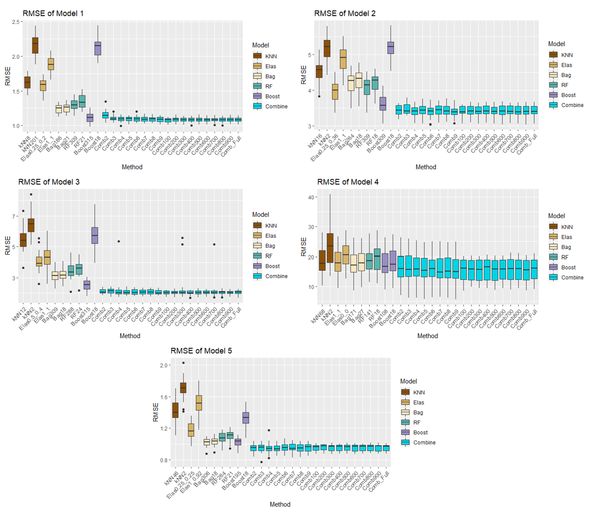]

???

- Le pire cas et le meilleur cas.
---
## Simulated data (computational times)

.center[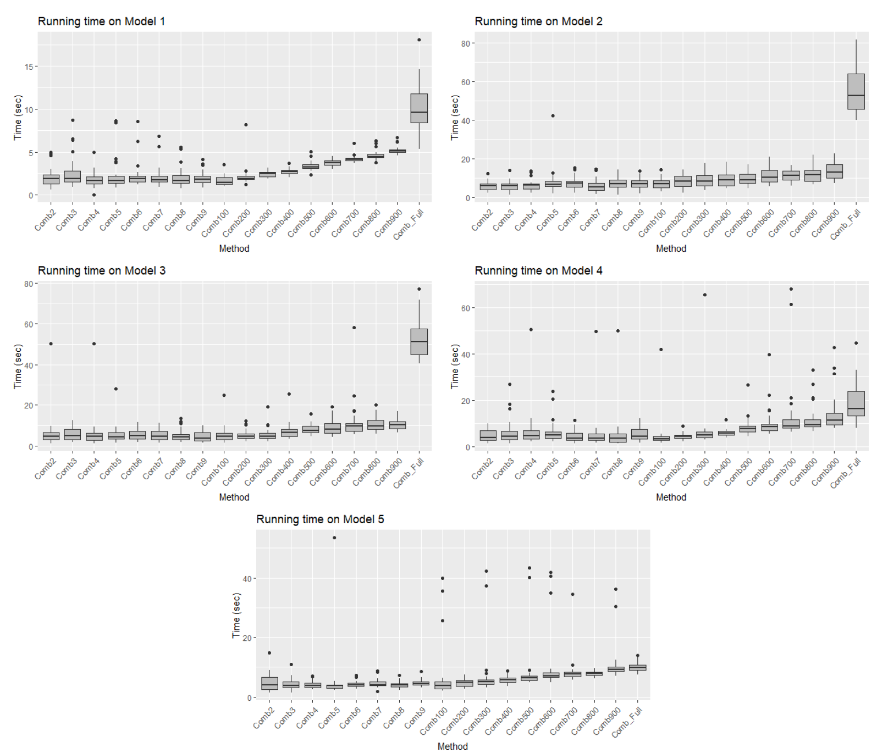]

---
## Real data (RMSE)

.center[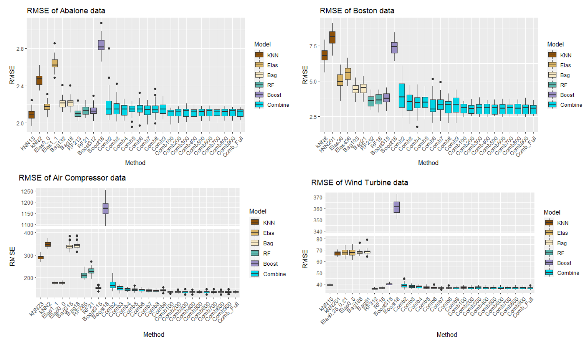]

---
## Real data (computational times)

.center[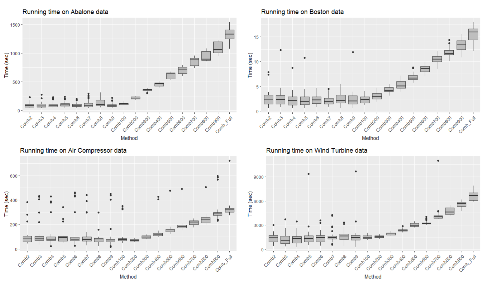]

---
## Conclusion

- Numerically, the full aggregation method works well even on high-dimensional (very correlated) features of predictions.

- The performances are almost preserved in much smaller subspaces.

- Several types of (highly redundant) models can be aggregated without model selection or cross validation.

- Theoretically and numerically, $m\approx O(\log(n))$ works.

---
class: center, middle, inverse
count: false

.center[# .section[Conclusion & perspectives]]

---
### Summary<hbr>
- .stress[KFC procedure] :<hbr>
  - Three-step procedure : .stress[K-means / Fitting / Combining]
  - Numerical experiments : simulated and real energy data
  - Codes & documentation.<hbr>

- .stress[A Kernel-based aggregation for regression] :<hbr>
  - Theoretical study : consistency inheritance property & convergence rate
  - Optimization : gradient descent minimizing $\kappa$-cross validation error
  - Numerical experiments & application on physics data
  - Codes & documentation.<hbr>

- .stress[Aggregation on randomly projected high-dimensional features] :<hbr>
  - Theoretical study : high probability bound (.stress[full] - .stress[projected])
  - Numerical experiments on simulated and real data
  - Codes & documentation.<hbr>
  
- Joint work with researchers from CEA [[Kluth et al. (2022)](https://www.frontiersin.org/articles/10.3389/fphy.2022.786639/full)].<hbr>

### Perspectives<hbr>
- High-dimensional .stress[KFC procedure] : random projection with Bregman divergences.
- Domain adaptation-like property of the aggregation method.

---
count: false
```{r child='closing_slide.Rmd'}

```

---
## Work summary

.center[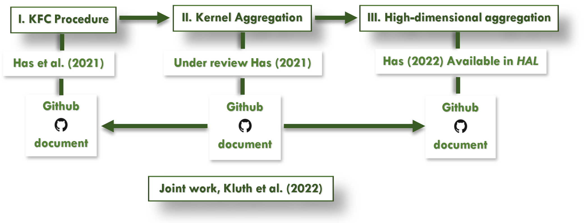]

---
count: false
class: left, top, inverse
```{r child='references.Rmd'}

```
